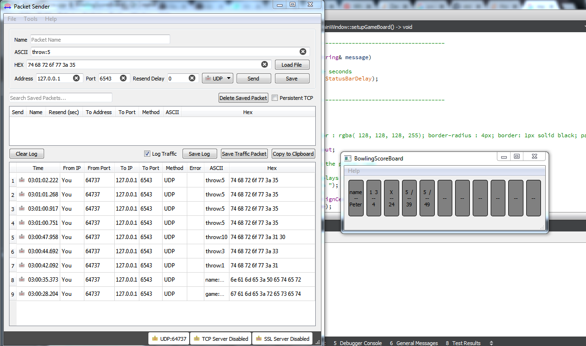

# BowlingScoreBoard

author: **mail@marcelpetrick.it**

# How to build?
Build via qmake (pro file) or cmake (CMakeLists.txt; tested under Linux, CMake 3.2, GCC 4.9 and Qt 5.10).  
Builds and runs with: Linux, Qt 5.10 and QtCreator 4.7-rc1, GCC 4.9  
Builds and runs with: Windows 7, Qt 5.11 and QtCreator 4.7; compiler from Visual Studio 2017 Community Edition.  

# How to use?
Run the binary. It will bind automatically via UDP to localhost:6543.  
Send messages via UDP (hint: use the open-source program "Packet Sender" oder sendip) to the BowlingScoreBoard.  
This simulates the external character of the pin-counting-machine.  

# Assumptions
Accepts messages for controlling the BowlingScoreBoard via UDP: hard-coded to localhost:6543 (see BSB_UdpListener.h)  

* new game can be started via "game:reset"
* player-name can be set via "name:Klaus"
* name-handling; player-name has to be purely alphanumeric and will be truncated at ten characters.
* data for the current throw can be sent via "throw:8" (or whatever value from the range [0..10]
(Please also view the image "packetSenderConfig_runtimeView.png" if question for PacketSender exist.)

If the "end" of the possible throws is reached, nothing special will happen.  
Messages are accepted, but not processed in a way that the state of the game-board changes.  
Player has to reset actively the game (see above).  

# Potential improvements
Use definitely QTest to unit-test the BSB_GameData (which handles the throw-insertion and the calculates the score).  
Fix the "bonus throws" in the last frame. Perfect game with a score of 300 is currently not possible.  
